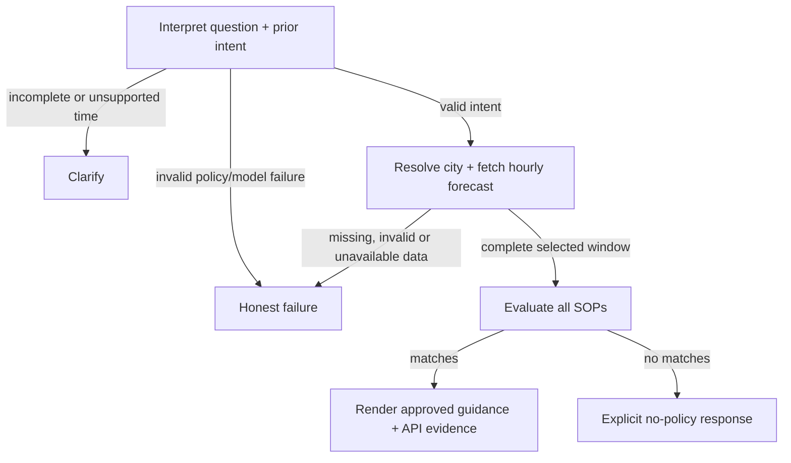

# Weatherwise — BrainWave intern assignment

A chat app that checks outdoor plans against live Open-Meteo forecasts and editable SOPs. LangGraph routes interpretation, clarification, data fetching, policy evaluation, and honest failure. The model extracts intent; Python selects policies and renders their exact guidance with API evidence.

## Run locally

Requires Python 3.11+ and [uv](https://docs.astral.sh/uv/). From this directory:

```bash
uv sync --group dev
cp .env.example .env
uv run streamlit run app.py
```

Open http://localhost:8501. Streamlit serves the frontend and runs the backend graph in the same process; there is no separate backend server. Internet access is needed for geocoding and forecasts.

On Windows PowerShell, use a separate environment when sharing the folder with WSL:

```powershell
$env:UV_PROJECT_ENVIRONMENT = ".venv-windows"
uv sync --group dev
if (!(Test-Path .env)) { Copy-Item .env.example .env }
uv run streamlit run app.py
```

Set that environment variable again in each new PowerShell terminal.

The default **demo** mode needs no model key. It is a limited keyword parser, clearly labeled in the UI. To meet the assignment's semantic language understanding requirement, configure `.env`:

```dotenv
MODEL_PROVIDER=openai
OPENAI_API_KEY=your-key-here
OPENAI_MODEL=gpt-4.1-mini
```

Create a key at [OpenAI API keys](https://platform.openai.com/api-keys) and configure API billing in the platform. The OpenAI adapter uses the Responses API with strict structured output and `store=false`. No extra Python dependency is needed. Anthropic is also supported: set `MODEL_PROVIDER=anthropic`, `ANTHROPIC_API_KEY`, and optionally `ANTHROPIC_MODEL=claude-sonnet-4-5` instead.

Restart Streamlit after changing `.env`. A missing key or failed model request returns an explicit failure, never a silent downgrade to demo. `.env` is ignored by Git; use only `.env.example` for shared configuration. The question and structured conversation context are sent to your selected provider; the city is sent to Open-Meteo. Chat history lives in Streamlit session memory, not a database.

Try “Can I cycle in Bhopal today?” then “What about tomorrow evening instead?” The second turn reuses the city and activity and fetches a fresh forecast for the new window. “New conversation” clears all session state.

## Architecture and enforcement



- `weather_advisor/interpret.py`: the model can return only a validated intent object. Its output cannot contain weather facts, policy IDs, or advice. Activity descriptions are loaded from policy data. User instructions are treated as data, not authority. This limits injection impact but does not prove an LLM will always classify intent correctly.
- `weather_advisor/weather.py`: requests explicit coordinates and hourly fields, checks units and numeric values, requires full coverage of the selected window, and rejects missing/null/nonfinite values. It retains the raw API response and request URL for auditing.
- `weather_advisor/policy.py`: a validated `all`/`any` condition language evaluates each forecast hour. Compound conditions must coincide in the same hour. No arbitrary Python execution or model judgment determines numeric matches.
- `weather_advisor/graph.py`: explicit conditional graph edges select clarification, data failure, advice, or no-match outcomes. `render()` inserts exact approved policy text and values copied from a matching API row. No generative model writes the final reply, so a model cannot embellish its numbers or invent recommendations.
- `app.py`: a conversational thread, fresh graph invocation per turn, and expandable intent/policy/raw-weather evidence. Only structured intent is carried into the next invocation; previous weather, policy matches, and errors cannot leak into it.

The answer exposes the resolved location, timezone, evaluated window, SOP ID/version, matching sample and number of matching hours. For ambiguous city names the first geocoding result is used and explicitly disclosed, as allowed by the brief.

## Policy choices and adding a rule live

`policies/sops.yaml` contains **13 original SOPs across 5 categories**, with low, moderate, high and critical severities. YAML keeps descriptions, conditions, severity and approved text together for review and editing without changing model/weather code.

Rules are loaded on every turn. Add this entry to the `policies` list and send another question; no graph rebuild or code edit is needed:

```yaml
- id: PARK-01
  version: 1
  title: Cold park outing
  category: leisure
  severity: moderate
  when:
    all:
      - {field: activity, op: eq, value: park}
      - {field: temperature_2m, op: lt, value: 8}
  guidance: "For this cold park outing, use warm layers and keep the visit brief."
```

Available factual fields and units are in `policy.FIELDS`. Supported operators are `eq`, `in`, `gte`, `gt`, `lte`, `lt`, with nested `all`/`any`. Intent fields are `activity` and `group`. Activity descriptions are also editable and flow into the model prompt/schema. New rules over supported fields need no code changes; a new weather variable, new operator, or new group taxonomy requires an explicitly acknowledged schema/provider extension. The limited demo parser does not automatically learn new activities; both model providers read their descriptions.

All matches are shown, ranked by severity, priority, then stable ID. Area hazards rank above activity-specific rules at the same severity. Low-severity comfort guidance is suppressed if any high/critical rule matches anywhere in the window. Recommendations apply to their matching hours, not necessarily every hour in the requested period; replies make the coverage explicit. Higher severity is never silently discarded because another rule also applies.

`LEISURE-01` handles a fuzzy request such as “spread a blanket for sandwiches”: the model maps the meaning to the picnic intent, then a categorical fog/rain weather-code condition selects approved venue guidance. It uses no single numeric weather threshold. This deliberately separates semantic interpretation from factual policy eligibility.

`AREA-02` covers coincident rain and gusts across **all** activities, including unsupported categories. It captures a compound hazard without reducing the decision to a single extreme threshold. `AREA-01` similarly gives thunderstorms cross-category precedence. These rules do **not** identify a low-pressure system or assert an IMD alert: Open-Meteo forecast variables alone are insufficient evidence for a named official event. An authoritative alert feed with location, validity intervals, and source attribution would be needed for that additional capability. No September example event is hardcoded into the app.

The thresholds and advice are assignment policies, not validated meteorological, medical, or emergency-service standards. A real deployment needs domain review of the catalog. No-match means “no guidance,” never “safe.”

## Time and session behavior

- Windows are resolved in the forecast location's timezone: morning 06–12, afternoon 12–17, evening 17–22 (end exclusive).
- “Today” evaluates the remaining hourly samples from the current local hour. “Now” uses that hour's **forecast**, not an observation. The current hourly interval may already be partly elapsed.
- OpenAI and Anthropic modes support relative day offsets 0–6. Demo mode supports today/tomorrow. Exact clock times, calendar dates, and past/out-of-range requests require clarification.
- A passed window fails explicitly instead of silently switching dates. Missing hours and duplicate local timestamps fail closed; special repeated-hour DST cases are therefore unsupported.
- Every turn fetches fresh data. New evidence can change a recommendation; timestamps and matching values make the basis visible. There is no cross-user or restart persistence and no cached forecast fallback.

## Verification

```bash
uv run pytest -q --junitxml=evals/pytest-results.xml
uv run ruff check .
uv run python -m evals.run --live --model
```

Fixture tests verify policy boundaries, compound-hour matching, multiple matches, exact evidence, missing data, API/location failure, injection containment, session isolation, follow-up changes, and adding a policy to a running graph. They do not establish real-model language accuracy.

`--live` searches a bounded set of locations for **actually fetched** high/critical conditions and saves raw responses, timestamps, matching SOPs, answers and traces to `evals/live_results.json`. If no qualifying conditions are found, or the API cannot be reached, the result is `NOT_DEMONSTRATED` and the command exits nonzero. A live result proves only that particular run. Repeatable regression coverage uses clearly labeled fixture data alongside this changing live integration check.

`--model` exercises real-model paraphrases and injection resistance using `MODEL_PROVIDER` and its corresponding key. With demo mode or without a key, it records `NOT_RUN`, not a pass. See [evals/REPORT.md](evals/REPORT.md) for the actual execution results and limitations.

## Scope and tradeoffs

This is a compact take-home implementation: one local app, one model call per interpreted turn, no vector database, no deployment, no authentication, no durable storage. Deterministic final wording sacrifices stylistic flexibility to make advice and numbers auditable. Validated intent may still be semantically wrong, so the UI exposes it and evaluations should be expanded with real model runs before relying on it.

The full forecast is required for all catalog weather fields; even an unrelated missing field currently causes an honest failure. This favors consistency over partial availability. Weather transport retries connection failures once and has a finite timeout; provider rate limits and outages return the failure branch.

## Primary implementation references

- [LangGraph graph API](https://docs.langchain.com/oss/python/langgraph/graph-api): StateGraph and conditional edges.
- [Open-Meteo forecast documentation](https://open-meteo.com/en/docs): hourly variables, unit selection, local timezone and weather codes.
- [Open-Meteo geocoding](https://open-meteo.com/en/docs/geocoding-api): city resolution.
- [Anthropic Messages API](https://platform.claude.com/docs/en/api/http/messages): forced intent-extraction tool call.
- [OpenAI Structured Outputs](https://developers.openai.com/api/docs/guides/structured-outputs): Responses API schema enforcement, with local validation and refusal/incomplete-response handling.
