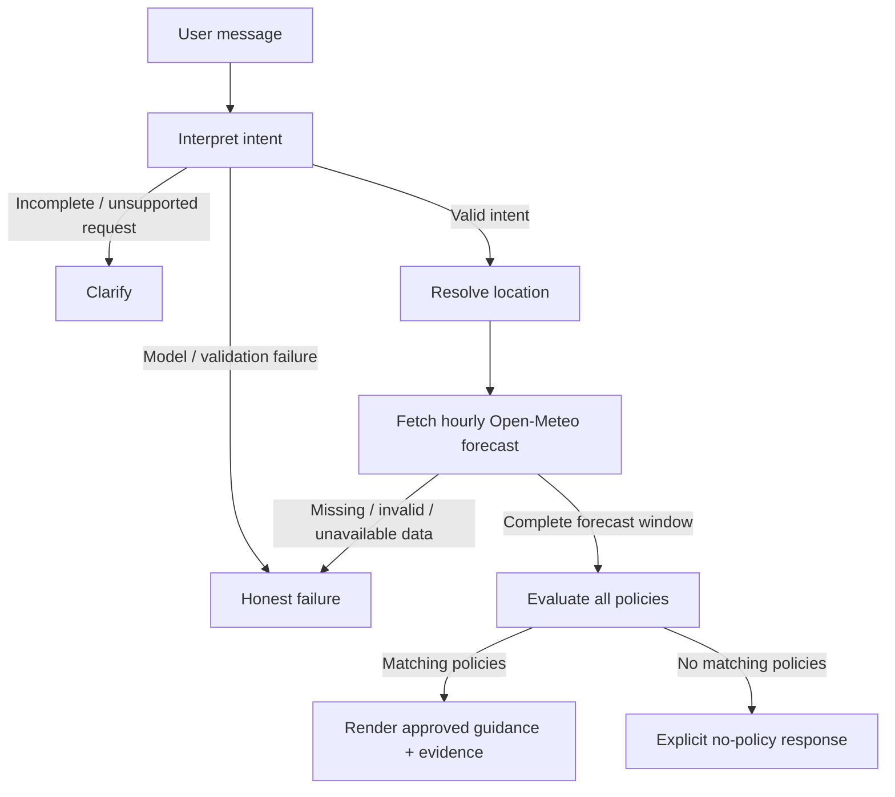

# Weather Policy Engine

A policy-driven weather decision assistant that evaluates outdoor activities against live [Open-Meteo](https://open-meteo.com/) forecasts and versioned, editable operating policies.

The system combines **LangGraph orchestration**, **structured LLM intent extraction**, **live weather data**, and a **deterministic policy engine**.

The language model interprets what the user means. Python owns the facts, policy evaluation, evidence, and final response.

> **Core principle:** the model may interpret intent, but it does not decide weather facts, select policy IDs, calculate policy matches, or write the final recommendation.

---

## Overview

Weather Policy Engine answers questions such as:

> "Can I cycle in Bhopal today?"

and follow-ups such as:

> "What about tomorrow evening instead?"

The system resolves the requested activity and time window, obtains a fresh forecast, evaluates the applicable policies hour-by-hour, and returns only guidance supported by the configured policy catalog and weather evidence.

### Key capabilities

* Natural-language activity and time interpretation
* Conversational follow-up support
* Live city geocoding and hourly weather forecasts
* Editable YAML-based policies
* Deterministic `all` / `any` policy evaluation
* Hour-level compound-condition matching
* Severity and priority handling
* Fail-closed behavior for missing or invalid weather data
* Explicit clarification for unsupported or ambiguous requests
* Evidence-backed responses
* Model/provider abstraction
* OpenAI, Anthropic, OpenRouter, and demo-mode support
* Fixture-based regression testing
* Optional live and real-model evaluation
* No database or persistent user state required

---

## Architecture



### Processing flow

```text
User message
    ↓
Intent extraction
    ↓
Intent validation
    ↓
Location resolution
    ↓
Fresh hourly forecast
    ↓
Forecast validation
    ↓
Deterministic policy evaluation
    ↓
Severity / priority ordering
    ↓
Approved policy guidance
    ↓
Weather evidence
    ↓
Final response
```

---

## Design Principles

### 1. LLM for interpretation, not decision-making

The model produces a strictly validated intent object.

It cannot return:

* Weather facts
* Policy IDs
* Policy matches
* Numerical recommendations
* Final advice

This creates a clear boundary between probabilistic language interpretation and deterministic business logic.

The model can still classify intent incorrectly; structured output does not guarantee semantic correctness. The resolved intent is therefore exposed in the UI and tested independently.

### 2. Deterministic policy evaluation

Policy matching is performed entirely in Python.

The evaluator supports:

* `eq`
* `in`
* `gte`
* `gt`
* `lte`
* `lt`
* Nested `all`
* Nested `any`

No arbitrary Python execution is permitted through policy configuration.

Compound conditions must match within the same forecast hour.

### 3. Evidence-backed responses

Final responses are rendered from approved policy text and values taken directly from matching forecast rows.

The generative model does not write the final recommendation.

This prevents the response layer from:

* Inventing weather values
* Modifying policy guidance
* Adding unsupported recommendations
* Reinterpreting numeric thresholds

### 4. Fail closed

The system does not convert missing evidence into a positive recommendation.

Examples:

* Missing forecast data → explicit failure
* Invalid weather values → explicit failure
* Failed location resolution → explicit failure
* Model failure → explicit failure
* No matching policy → explicit "no guidance" response

**No-match means no applicable guidance, not "safe."**

---

# Repository Structure

```text
.
├── app.py
├── weather_advisor/
│   ├── interpret.py
│   ├── weather.py
│   ├── policy.py
│   └── graph.py
├── policies/
│   └── sops.yaml
├── evals/
│   ├── REPORT.md
│   ├── run.py
│   ├── fixtures/
│   └── live/
├── tests/
├── .env.example
├── pyproject.toml
└── README.md
```

### Component responsibilities

| Component              | Responsibility                                                       |
| ---------------------- | -------------------------------------------------------------------- |
| `app.py`             | Streamlit UI and conversational session handling                     |
| `interpret.py`       | Structured intent extraction and validation                          |
| `weather.py`         | Geocoding, forecast retrieval, validation and raw-response retention |
| `policy.py`          | Policy loading and deterministic condition evaluation                |
| `graph.py`           | LangGraph orchestration and conditional routing                      |
| `policies/sops.yaml` | Editable policy catalog                                              |
| `evals/`             | Regression, live and model-based evaluation                          |

---

# Local Development

## Requirements

* Python 3.11+
* [uv](https://docs.astral.sh/uv/)
* Internet access for geocoding and forecasts
* Optional model-provider API key

The application runs as a single local Streamlit process. There is no separate backend server.

## Installation

```bash
uv sync --group dev
```

Create the local environment file:

```bash
cp .env.example .env
```

Start the application:

```bash
uv run streamlit run app.py
```

Open:

```text
http://localhost:8501
```

---

## Windows + WSL Development

When sharing the repository between WSL and Windows, use a separate virtual environment for Windows.

### PowerShell

```powershell
$env:UV_PROJECT_ENVIRONMENT = ".venv-windows"

uv sync --group dev

if (!(Test-Path .env)) {
    Copy-Item .env.example .env
}

uv run streamlit run app.py
```

Set `UV_PROJECT_ENVIRONMENT` again when opening a new PowerShell session.

---

# Model Providers

The application supports multiple model providers through a common configuration interface.

## Demo mode

Demo mode requires no API key.

It uses a limited keyword-based parser and is clearly identified in the UI.

Demo mode is intended for local execution without credentials. It does **not** provide the semantic language understanding expected from a production model.

---

## OpenAI

Configure `.env`:

```dotenv
MODEL_PROVIDER=openai
OPENAI_API_KEY=your-key-here
OPENAI_MODEL=gpt-4.1-mini
```

Create an API key through the [OpenAI API platform](https://platform.openai.com/api-keys).

The OpenAI adapter uses the Responses API with structured output and `store=false`.

---

## Anthropic

Configure:

```dotenv
MODEL_PROVIDER=anthropic
ANTHROPIC_API_KEY=your-key-here
ANTHROPIC_MODEL=claude-sonnet-4-5
```

The Anthropic adapter uses a forced structured tool call for intent extraction.

---

## OpenRouter

Configure:

```dotenv
MODEL_PROVIDER=openrouter
OPENROUTER_API_KEY=your-openrouter-key-here
OPENROUTER_MODEL=openai/gpt-4.1-mini
```

The application automatically uses the OpenRouter chat-completions endpoint.

OpenRouter model names must use the complete provider/model identifier.

See:

* [OpenRouter Quickstart](https://openrouter.ai/docs/quickstart)
* [OpenRouter Structured Outputs](https://openrouter.ai/docs/guides/features/structured-outputs)

OpenRouter usage is billed through the OpenRouter account and does not consume a direct OpenAI API balance.

The selected provider receives the user question and structured conversation context. The resolved city is sent to Open-Meteo for geocoding and forecast retrieval.

---

## Provider failure behavior

Changing `.env` requires restarting Streamlit.

A missing API key or failed model request produces an explicit failure.

The application does **not** silently downgrade from a configured provider to demo mode.

`.env` is ignored by Git. Shared configuration belongs in `.env.example`.

---

# Policy Engine

Policies are stored in:

```text
policies/sops.yaml
```

The repository currently contains **13 original SOPs across 5 categories**, covering low, moderate, high and critical severity levels.

Policies keep their:

* ID
* Version
* Title
* Category
* Severity
* Conditions
* Approved guidance

in one editable document.

This allows policy changes without modifying model or weather-fetching code.

---

## Example policy

```yaml
- id: PARK-01
  version: 1
  title: Cold park outing
  category: leisure
  severity: moderate
  when:
    all:
      - {field: activity, op: eq, value: park}
      - {field: temperature_2m, op: lt, value: 8}
  guidance: "For this cold park outing, use warm layers and keep the visit brief."
```

Policies are loaded on every turn.

After adding a policy, the application can evaluate it on the next request without rebuilding the graph or changing Python code.

---

## Supported policy fields

Available factual fields and units are defined in:

```text
weather_advisor/policy.py
```

Supported operators:

```text
eq
in
gte
gt
lte
lt
```

Supported logical operators:

```text
all
any
```

Intent fields include:

```text
activity
group
```

Activity descriptions are also part of the editable policy configuration and are supplied to the model during intent interpretation.

---

## Policy extensions

New rules using existing supported fields and operators do not require code changes.

The following require an explicit schema/provider extension:

* New weather variables
* New comparison operators
* New intent fields
* New group taxonomy
* New data providers
* New evidence types

The demo parser does not automatically learn new activities. Model-based adapters use the configured activity descriptions.

---

# Policy Resolution

When multiple policies match, results are ordered by:

1. Severity
2. Priority
3. Stable policy ID

Area-wide hazards take precedence over activity-specific policies at the same severity.

Low-severity comfort guidance is suppressed when a high or critical policy applies anywhere in the requested window.

Recommendations remain tied to their matching forecast hours.

For example, a policy matching only 18:00–20:00 does not automatically become guidance for the entire requested evening window.

The response exposes the evaluated coverage explicitly.

Higher-severity matches are never silently discarded simply because another policy also matches.

---

# Special Policy Cases

## Fuzzy leisure requests

`LEISURE-01` handles semantic requests such as:

> "Spread a blanket for sandwiches."

The model maps the request to the configured picnic intent.

Policy evaluation then uses categorical fog/rain weather-code conditions to determine whether the approved venue guidance applies.

The decision does not depend on a single arbitrary numeric weather threshold.

This deliberately separates:

```text
Semantic interpretation
        ↓
Validated intent
        ↓
Factual weather
        ↓
Deterministic policy
```

---

## Cross-category hazards

`AREA-02` evaluates coincident rain and gust conditions across activities, including unsupported categories.

`AREA-01` provides cross-category handling for thunderstorms.

These policies intentionally avoid claiming the presence of an official weather warning or named meteorological event.

Open-Meteo forecast variables alone are insufficient evidence for claims such as an official IMD alert or a named low-pressure system.

Supporting such claims would require an authoritative alert source containing appropriate:

* Location
* Validity intervals
* Alert type
* Severity
* Source attribution

No September example event is hardcoded into the application.

---

# Weather Data Handling

`weather.py` is responsible for:

* City geocoding
* Coordinate resolution
* Forecast retrieval
* Explicit hourly field selection
* Unit validation
* Numeric validation
* Missing-value detection
* Non-finite-value rejection
* Window coverage validation
* Raw API response retention
* Request URL retention

The selected forecast window must have complete coverage.

Missing or invalid values cause the graph to follow the explicit failure path rather than silently evaluating incomplete evidence.

Weather transport retries connection failures once and uses a finite request timeout.

Provider outages and rate limits are surfaced as failures.

There is no cached forecast fallback.

---

# Time Semantics

Forecast windows are evaluated using the forecast location's local timezone.

| Period    | Hours        |
| --------- | ------------ |
| Morning   | 06:00–12:00 |
| Afternoon | 12:00–17:00 |
| Evening   | 17:00–22:00 |

End times are exclusive.

### Relative dates

Model-backed providers support relative day offsets from:

```text
0–6 days
```

Demo mode supports:

```text
today
tomorrow
```

### "Now"

`Now` refers to the current hourly **forecast**, not a real-time observation.

The current hourly interval may already be partially elapsed.

### Unsupported requests

The application asks for clarification when the request requires unsupported:

* Exact clock times
* Calendar dates
* Past dates
* Out-of-range dates
* Ambiguous time windows

### Window failures

A requested window that cannot be fully represented by the forecast fails explicitly.

The application does not silently switch to another date.

Duplicate local timestamps and missing hours also fail closed. Special repeated-hour DST scenarios are therefore intentionally unsupported.

---

# Conversational State

Each user turn creates a fresh graph invocation.

Only validated structured intent is carried into the next invocation.

Previous:

* Weather responses
* Policy matches
* Errors
* Generated answers

cannot leak into subsequent graph execution.

Chat history exists only in Streamlit session memory.

There is:

* No database
* No cross-user state
* No restart persistence
* No server-side conversation storage

Selecting **New conversation** clears the Streamlit session state.

Every turn retrieves fresh weather evidence.

---

# Security and Trust Boundaries

The application intentionally separates untrusted language input from deterministic execution.

### User input

User instructions are treated as data, not as authority over policy configuration.

### LLM output

Model output is accepted only after schema validation.

The model cannot directly:

* Execute Python
* Choose arbitrary policy IDs
* Inject weather values
* Write final recommendations

### Policy configuration

Policy YAML is interpreted through a restricted condition language.

No arbitrary Python expressions are executed.

### Weather API

Weather values are validated before policy evaluation.

### Final response

The final response is assembled from:

```text
Approved policy guidance
+
Validated weather evidence
+
Resolved request metadata
```

This reduces the attack surface of prompt injection and model hallucination, but does not guarantee perfect intent classification or eliminate all application-level security risks.

---

# Response Evidence

The UI exposes the evidence used to produce an answer.

Depending on the result, this includes:

* Resolved location
* Forecast timezone
* Evaluated time window
* Selected intent
* SOP ID
* SOP version
* Policy severity
* Matching sample
* Number of matching hours
* Relevant raw weather response
* Failure reason when applicable

This makes the decision trace inspectable instead of presenting an unexplained model-generated answer.

---

# Verification

Run the test suite:

```bash
uv run pytest -q --junitxml=evals/pytest-results.xml
```

Run linting:

```bash
uv run ruff check .
```

Run live evaluation:

```bash
uv run python -m evals.run --live --model
```

---

## Test coverage

Fixture tests cover:

* Policy boundaries
* Compound-hour matching
* Multiple simultaneous matches
* Exact evidence rendering
* Missing weather data
* API failures
* Location failures
* Prompt-injection containment
* Session isolation
* Follow-up requests
* Changed time windows
* Runtime policy additions

These tests validate deterministic application behavior.

They do **not** establish real-world language-model accuracy.

---

# Live Evaluation

The `--live` evaluation searches a bounded set of locations for actually fetched high/critical conditions.

Results are written to:

```text
evals/live_results.json
```

The result can contain:

* Raw API responses
* Retrieval timestamps
* Matching SOPs
* Generated answers
* Execution traces

If qualifying conditions cannot be found, or the API cannot be reached, the result is:

```text
NOT_DEMONSTRATED
```

and the command exits non-zero.

A successful live run demonstrates only the behavior observed during that specific execution.

It should not be treated as a permanent guarantee because weather data changes over time.

---

# Model Evaluation

Use:

```bash
uv run python -m evals.run --model
```

The model evaluation exercises:

* Natural-language paraphrases
* Intent extraction
* Follow-up interpretation
* Injection resistance

The configured provider is selected through:

```text
MODEL_PROVIDER
```

When no model key is available, the evaluation records:

```text
NOT_RUN
```

rather than incorrectly treating demo-mode execution as a model pass.

See:

```text
evals/REPORT.md
```

for execution results and known limitations.

---

# Limitations and Trade-offs

This repository intentionally favors a compact, auditable architecture over production platform complexity.

Current scope:

* Single local Streamlit application
* One model call per interpreted turn
* No vector database
* No authentication
* No durable conversation storage
* No deployment configuration
* No persistent user profiles
* No authoritative weather-alert feed

### Deterministic final rendering

The final response is deliberately less stylistically flexible than a fully generative chatbot.

The trade-off is stronger auditability.

### Full forecast validation

The current implementation requires all catalog weather fields to be available.

Even an unrelated missing field can cause an explicit failure.

This favors consistency and predictable behavior over partial availability.

### Language-model accuracy

Structured output validates the shape of the model response, not whether the semantic interpretation is correct.

Real deployments should expand model evaluation using representative user language and adversarial examples.

---

# Domain Disclaimer

The thresholds and guidance in `policies/sops.yaml` are **assignment policies**.

They are not validated:

* Meteorological standards
* Medical guidance
* Emergency-service procedures
* Government weather warnings
* Official safety standards

A production deployment should have the policy catalog reviewed and approved by the appropriate domain experts.

The system must not represent a policy match—or lack of one—as an official safety determination.

---

# Development Workflow

Recommended local workflow:

```bash
# Install dependencies
uv sync --group dev

# Run tests
uv run pytest -q

# Run lint
uv run ruff check .

# Start application
uv run streamlit run app.py
```

Before submitting changes:

1. Update or add tests.
2. Validate policy behavior.
3. Run the complete test suite.
4. Run Ruff.
5. Run model evaluation when model-related behavior changes.
6. Update `evals/REPORT.md` when evaluation behavior or results change.
7. Keep policy changes separate from implementation changes where possible.

---

# Primary References

* [LangGraph Graph API](https://docs.langchain.com/oss/python/langgraph/graph-api) — `StateGraph` and conditional graph edges.
* [Open-Meteo Forecast API](https://open-meteo.com/en/docs) — hourly variables, units, timezone handling and weather codes.
* [Open-Meteo Geocoding API](https://open-meteo.com/en/docs/geocoding-api) — location resolution.
* [Anthropic Messages API](https://platform.claude.com/docs/en/api/http/messages) — structured intent extraction.
* [OpenAI Structured Outputs](https://developers.openai.com/api/docs/guides/structured-outputs) — schema-constrained model responses and validation behavior.
* [OpenRouter Quickstart](https://openrouter.ai/docs/quickstart) — OpenRouter configuration.
* [OpenRouter Structured Outputs](https://openrouter.ai/docs/guides/features/structured-outputs) — structured-output compatibility.

---

# License

Add the repository's applicable license here before public distribution.
